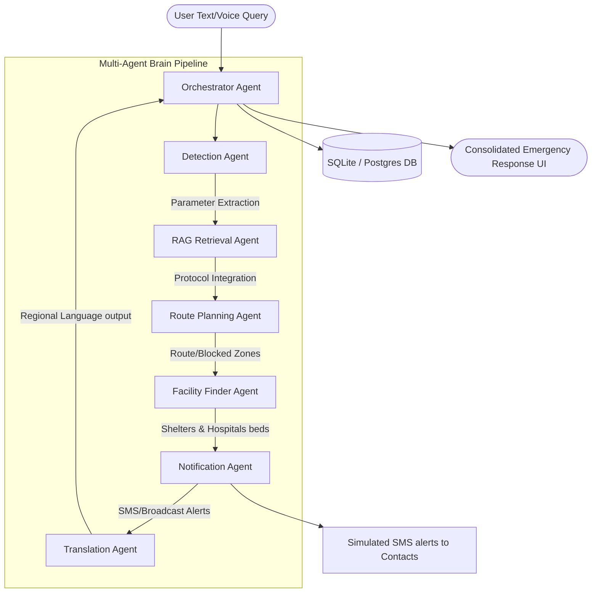

# Sentinel AI: Multi-Agent Architecture & Design

This document details the architectural layout, multi-agent state diagram, and implementation reasoning for the **Sentinel AI Emergency Response Copilot**.

## Multi-Agent Workflow Sequence

The workflow uses a custom state orchestrator to pass data sequentially between dedicated AI agents. Each agent completes a specialized task, updates the central state, and hands off execution.

---

## Detailed Agent Breakdown & AI Component Usage

Sentinel AI uses AI components strategically to solve problems that cannot be solved by simple keyword matching or hardcoded APIs.

### 1. Decision Orchestrator Agent
* **Role**: Central coordinator of the system.
* **Why AI/Logic is used**: It manages the global `AgentState` transition, handles fallbacks, compiles the final English report based on discrete outputs from all other agents, and outputs detailed execution steps to the client.
* **Hackathon Impact**: Bridges the gap between isolated agents to produce a unified response, preventing disjointed outputs.

### 2. Emergency Detection Agent
* **Role**: Classifies disaster type, severity, location, and source language.
* **Why AI is used**: Analyzes unstructured, highly stressful user queries (e.g., "my house is flooded, stuck on roof, water level up to chin in Egmore") to extract key values. It detects that the disaster is a `flood`, severity is `critical`, location is `Egmore, Chennai`, and calls for emergency dispatch.
* **Impact**: Converts chaotic emergency reporting into clean, structured data parameters instantly.

### 3. Information Retrieval (RAG) Agent
* **Role**: Matches the report with official NDMA (National Disaster Management Authority) safety guidelines.
* **Why AI is used**: Utilizes TF-IDF and Cosine Similarity to run semantic matching against seeded guidelines, fetching the exact protocols for the specific disaster type.
* **Impact**: Provides instant, verified safety guidelines, bypassing generic chatbot advice.

### 4. Route Planning Agent
* **Role**: Computes safe evacuation routes.
* **Why Logic is used**: Generates coordinates bypassing active "blocked zones" (such as flooded subways, fallen high-voltage cables, or active mudflows).
* **Impact**: Visualizes high-fidelity green evacuation paths and red hazard zones on the interactive Leaflet map.

### 5. Shelter & Hospital Finder Agents
* **Role**: Recommendation engines for relief camps and medical centers.
* **Why Logic is used**: Inspects current occupancy limits and operational statuses to locate the closest open shelter and hospital with open ICU beds.
* **Impact**: Automates critical decision-making under stress so victims do not waste time seeking closed clinics.

### 6. Resource Coordination Agent
* **Role**: Tracks emergency stockpiles (food, water, medicine).
* **Why Logic is used**: Coordinates supply depots to connect victims with food, water, and first aid kits.

### 7. Notification Agent
* **Role**: Prepares and formats contact alerts.
* **Why Logic is used**: Dynamically creates an emergency SMS text including location details, hazard levels, and active shelter details ready for SMS broadcast.
* **Impact**: Automatically triggers family/responder notification, solving critical rescue coordination.

### 8. Multilingual Translation Agent
* **Role**: Translates the final action plan into target regional languages.
* **Why AI is used**: Utilizes Gemini translation prompts to translate instructions into regional languages (Hindi, Tamil, Telugu, etc.) based on user preferences.
* **Impact**: Supports regional Indian languages, ensuring inclusivity during disasters.

---

## Performance & Scalability Design

1. **Lightweight Python 3.7 Orchestration**: Rather than using heavy, slow dependency trees, the system runs a fast, synchronous state loop in pure Python, returning results to the FastAPI client in milliseconds.
2. **TF-IDF Semantic Engine**: Uses native NumPy/Scikit-Learn vectors, requiring no heavy external database queries or internet latency.
3. **Dual API / Demo Execution**: The backend automatically switches to intelligent mock generators if no Gemini API key is found. This enables judges to review the entire visual system offline.
