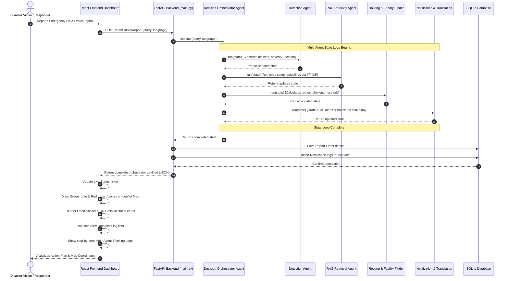

# Sentinel AI: Sequence Execution Workflow

This diagram outlines the detailed communication flow when a user reports an emergency.

```mermaid
sequenceDiagram
    autonumber
    actor User as Disaster Victim / Responder
    participant UI as React Frontend Dashboard
    participant API as FastAPI Backend (main.py)
    participant ORC as Decision Orchestrator Agent
    participant DET as Detection Agent
    participant RAG as RAG Retrieval Agent
    participant RTE as Routing & Facility Finder
    participant NOT as Notification & Translation
    participant DB as SQLite Database

    User->>UI: Reports Emergency (Text / Voice Input)
    UI->>API: POST /api/disaster/report {query, language}
    API->>ORC: execute(query, language)
    
    Note over ORC,NOT: Multi-Agent State Loop Begins
    ORC->>DET: run(state) [Classifies disaster, severity, location]
    DET-->>ORC: Return updated state
    
    ORC->>RAG: run(state) [Retrieves safety guidelines via TF-IDF]
    RAG-->>ORC: Return updated state
    
    ORC->>RTE: run(state) [Calculates routes, shelters, hospitals]
    RTE-->>ORC: Return updated state
    
    ORC->>NOT: run(state) [Drafts SMS alerts & translates final plan]
    NOT-->>ORC: Return updated state
    
    Note over ORC,NOT: State Loop Complete
    
    ORC-->>API: Returns completed state
    
    API->>DB: Save Report Event details
    API->>DB: Insert Notification logs for contacts
    DB-->>API: Confirm transaction
    
    API-->>UI: Return complete orchestrator payload (JSON)
    UI->>UI: Update Live Status ticker
    UI->>UI: Draw Green route & Red hazard zones on Leaflet Map
    UI->>UI: Render Open Shelter / ICU Hospital status cards
    UI->>UI: Populate Alert Broadcast log lists
    UI->>UI: Show step-by-step Multi-Agent Thinking Logs
    UI-->>User: Visualizes Action Plan & Map Coordinates
```
