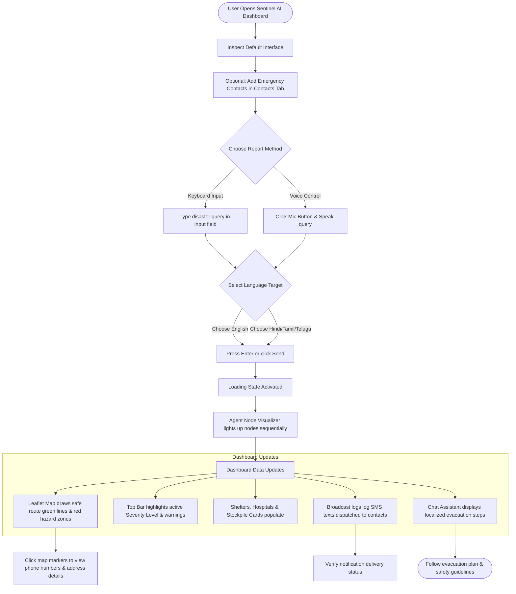

# Sentinel AI: User Flow Journey

This document visualizes the user interaction pathway inside the Sentinel AI Dashboard.

```mermaid
graph TD
    Start([User Opens Sentinel AI Dashboard]) --> Step1[Inspect Default Interface]
    Step1 --> Step2[Optional: Add Emergency Contacts in Contacts Tab]
    
    Step2 --> Step3{Choose Report Method}
    Step3 -- Keyboard Input --> TypeReport[Type disaster query in input field]
    Step3 -- Voice Control --> VoiceReport[Click Mic Button & Speak query]
    
    TypeReport --> SelectLang{Select Language Target}
    VoiceReport --> SelectLang
    
    SelectLang -- Choose English --> Submit[Press Enter or click Send]
    SelectLang -- Choose Hindi/Tamil/Telugu --> Submit
    
    Submit --> Processing[Loading State Activated]
    Processing --> Visualizer[Agent Node Visualizer lights up nodes sequentially]
    
    Visualizer --> StateUpdate[Dashboard Data Updates]
    
    subgraph Dashboard Updates
        StateUpdate --> MapView[Leaflet Map draws safe route green lines & red hazard zones]
        StateUpdate --> Ticker[Top Bar highlights active Severity Level & warnings]
        StateUpdate --> Cards[Shelters, Hospitals & Stockpile Cards populate]
        StateUpdate --> SMSLog[Broadcast logs log SMS texts dispatched to contacts]
        StateUpdate --> ChatPlan[Chat Assistant displays localized evacuation steps]
    end
    
    MapView --> InteractMap[Click map markers to view phone numbers & address details]
    SMSLog --> VerifySMS[Verify notification delivery status]
    ChatPlan --> FollowPlan([Follow evacuation plan & safety guidelines])
```
